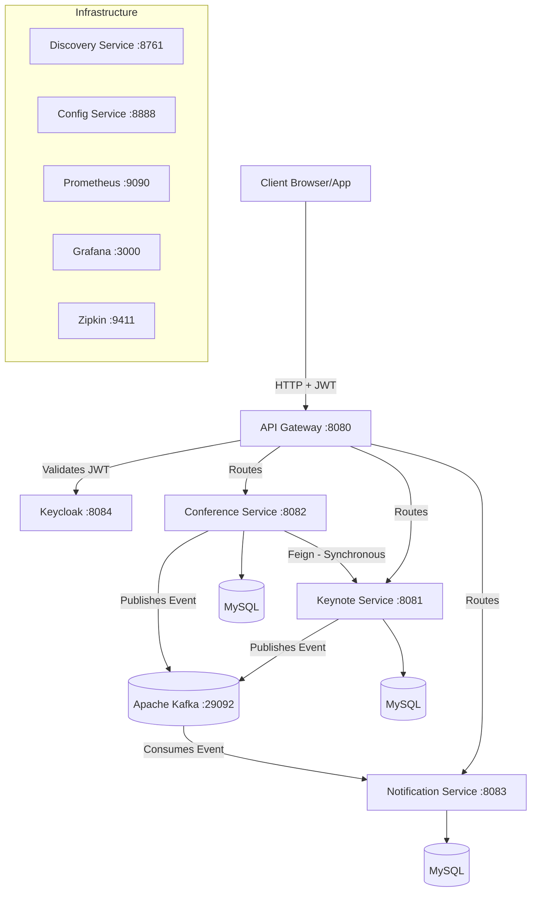

# 🎤 ConferenceHub — Microservices Architecture Guide

> **Comprehensive documentation** for the ConferenceHub microservices application. This project is a complete conference management platform built with Spring Boot, Spring Cloud, Kafka, and Keycloak, demonstrating modern microservice architecture and communication patterns.

---

## 📋 Table of Contents

1. [Project Overview](#-project-overview)
2. [Global Architecture & Services](#-global-architecture--services)
3. [Communication Patterns](#-communication-patterns)
4. [How to Run (Docker Compose)](#-how-to-run-docker-compose)
5. [Microservices Concepts & Technologies (The "Why")](#-microservices-concepts--technologies)

---

## 🎯 Project Overview

ConferenceHub is a comprehensive platform for managing conferences.

### Key Features:
- Manage **speakers** (Keynotes)
- Create and schedule **conferences**
- Send automated **notifications** via event-driven messaging
- Secure access using **Keycloak** (JWT / OAuth2 authentication)
- Complete **monitoring and tracing** stack

### Tech Stack:
- **Core:** Spring Boot 3.2.6, Java 17, Spring Data JPA
- **Cloud/Microservices:** Spring Cloud (Netflix Eureka, Config Server, API Gateway)
- **Communication:** OpenFeign (Synchronous), Apache Kafka (Asynchronous)
- **Resilience:** Resilience4J (Circuit Breaker, Retry, TimeLimiter)
- **Security:** Keycloak (OAuth2 Resource Server, JWT validation)
- **Databases:** MySQL (Production/Docker), H2 (Local Dev)
- **Monitoring & Observability:** Actuator, Prometheus, Grafana, Zipkin
- **Deployment:** Docker & Docker Compose
- **Documentation:** OpenAPI / Swagger (SpringDoc)

---

## 🏗 Global Architecture & Services

The application follows a standard microservices pattern with API Gateway routing, centralized configuration, and service discovery.



### Microservices List

| Service | Port | Description |
|---------|------|-------------|
| **`discovery-service`** | 8761 | Eureka Server registry where all services register themselves. |
| **`config-service`** | 8888 | Centralized configuration server securely serving properties to all services. |
| **`api-gateway`** | 8080 | The single entry point. Handles routing, load balancing, and JWT token validation. |
| **`keynote-service`** | 8081 | Manages speakers (Keynotes). Publishes events to Kafka upon creation. |
| **`conference-service`** | 8082 | Manages conferences. Fetches keynote details synchronously via Feign. Publishes events to Kafka. |
| **`notification-service`** | 8083 | Listens to Kafka topics and persists/sends notifications to users. |
| **`keycloak`** | 8084 | Identity and Access Management server (Authentication & Authorization). |
| **Monitoring** | Various | Prometheus (9090), Grafana (3000), Zipkin (9411) for full observability. |

---

## 🔄 Communication Patterns

Microservices in this project interact using two main paradigms:

### 1. Synchronous Communication (OpenFeign)
**When to use:** When a service needs an immediate response to proceed with its business logic.
**Example:** The `conference-service` needs the speaker's data to display a complete conference schedule. It sends an HTTP GET request to `keynote-service` using **OpenFeign**.
- **The Risk:** If `keynote-service` is down, `conference-service` could fail.
- **The Solution:** We use **Resilience4J Circuit Breaker** to provide a fallback (e.g., returning default/partial data) preventing cascading failures.

### 2. Asynchronous Communication (Apache Kafka)
**When to use:** When a service needs to inform others about an event, but doesn't need to wait for their response (Fire-and-Forget).
**Example:** When a new conference is created in `conference-service`, it publishes a `CONFERENCE_CREATED` event to **Kafka**. The `notification-service` is subscribed to this topic, consumes the event, and sends an email.
- **Advantages:** Decoupled services, high availability, and improved performance. If `notification-service` is temporarily down, the event sits safely in Kafka until the service restarts.

---

## 🐳 How to Run (Docker Compose)

The entire infrastructure and all microservices are containerized.

### Prerequisites
- Docker & Docker Compose installed
- Maven (to compile locally, though multi-stage Dockerfiles can handle it)
- Ports `8080-8084`, `8761`, `8888`, `3306`, `29092`, `9090`, `3000`, `9411` must be available.

### Startup Command

At the root of the project, run:
```bash
docker compose up --build -d
```

### Startup Order (Important)
Because of the heavy microservice architecture, services wait for their dependencies:
1. **Infra base:** MySQL, Zookeeper, Kafka, Keycloak, Zipkin, Prometheus, Grafana.
2. **Spring Cloud Infra:** `discovery-service` starts first. Then `config-service`.
3. **Gateway:** `api-gateway` starts after discovery and config.
4. **Business Services:** `keynote`, `conference`, and `notification` services start last.

### Verifying Startup

You can check logs using:
```bash
docker compose logs -f
```
Or view the Eureka dashboard at `http://localhost:8761` to ensure `api-gateway`, `keynote-service`, `conference-service`, and `notification-service` are registered.

---

## 🧠 Microservices Concepts & Technologies

If you are new to microservices, here is everything you need to know about the tools and concepts used in this project:

### 1. API Gateway (Spring Cloud Gateway)
- **What it is:** A server that acts as an API front-end, receiving API requests, enforcing throttling and security policies, passing requests to the back-end service, and then passing the response back to the requester.
- **Why we need it:** Instead of the client (Frontend/Mobile) maintaining the IPs and ports of 50 different microservices, the client only talks to the API Gateway (`http://localhost:8080`). It simplifies the client side, hides the internal structure, and provides a centralized place for Cross-Origin Resource Sharing (CORS) and security (JWT verification).

### 2. Service Registry & Discovery (Eureka)
- **What it is:** A directory of services. We use Netflix Eureka.
- **Why we need it:** Microservices scale up and down, and their IP addresses change dynamically (especially in Kubernetes or Docker). Services register themselves with Eureka when they start. When Service A needs to call Service B, it asks Eureka "Where is Service B?", and Eureka returns its current IP/port (also performing Local Load Balancing). This avoids hardcoding `http://localhost:8081` in our application code.

### 3. Centralized Configuration (Spring Cloud Config)
- **What it is:** Externalized configuration in a distributed system.
- **Why we need it:** If you have 10 microservices and you need to change the database password or the Kafka broker URL, you don't want to rebuild and redeploy 10 applications. A Config Server stores all `.yml`/`.properties` files in one place (often a Git repository) and serves them to microservices at startup.

### 4. Message Broker (Apache Kafka & Zookeeper)
- **What it is:** A distributed event streaming platform used for high-performance data pipelines, streaming analytics, data integration, and mission-critical applications.
- **Why we need it:** For asynchronous microservice communication. It guarantees message delivery and enables a highly decoupled architecture. Notification Service doesn't need to know who created the conference; it just listens to the `conference-events` topic.
- **Zookeeper:** Historically, Kafka used Zookeeper to manage cluster metadata, leader elections, and broker coordination. (Note: Newer versions of Kafka use KRaft, but traditional architectures still utilize Zookeeper).

### 5. Circuit Breaker (Resilience4J)
- **What it is:** A design pattern used to detect failures and encapsulate the logic of preventing a failure from constantly recurring.
- **Why we need it:** In a distributed system, a service can be slow or unresponsive. If Service A waits too long for Service B, it ties up its own threads, potentially crashing Service A as well (Cascading Failure). The Circuit Breaker monitors the calls; if the error rate exceeds a threshold, the circuit "opens," failing fast and immediately redirecting to a **Fallback** method (like a default response) until Service B recovers.

### 6. Identity & Access Management (Keycloak)
- **What it is:** An open-source software product to allow single sign-on with Identity and Access Management aimed at modern applications and services.
- **Why we need it:** Rather than implementing user tables, hashing passwords, and generating tokens inside our business logic, we delegate all authentication to Keycloak. Keycloak verifies the user and issues a **JWT (JSON Web Token)**. Our microservices only need to validate the JWT signature and read the roles (e.g., `ROLE_ADMIN`) embedded inside.

### 7. Observability & Monitoring (Prometheus, Grafana, Zipkin)
- **Actuator:** Exposes operational information about the running Spring application (health, metrics).
- **Prometheus:** A time-series database that pulls (scrapes) metrics exposed by Actuator (e.g., CPU usage, active DB connections, error rates).
- **Grafana:** A visualization tool that connects to Prometheus to build beautiful, real-time dashboards to visually monitor system health.
- **Zipkin:** A distributed tracing system. When a single user request passes through Gateway -> Conference Service -> Keynote Service, Zipkin generates a unique "Trace ID" to help developers track how long the request spent inside each specific service. This tracing is invaluable for debugging slow responses in complex systems.

---
*Created and managed as part of ConferenceHub platform documentation.*